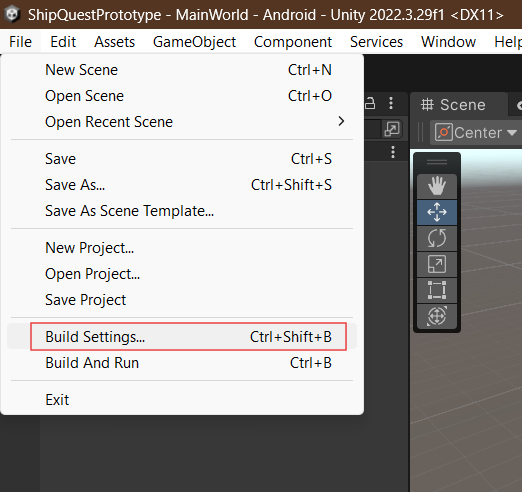

# Ship Quest Prototype

# Description

This is an early prototype of an augmented reality application designed to display spheres around the Shippensburg University campus. Students can use the app to explore campus by going to each of the spheres and collecting them. Each sphere is placed on a notable location, such as a building. Note that this app is not designed with other users in mind. However, by recompiling the app with your own locations, you can tailor it to suit your needs.

# Requirements

Required:
* Unity version 2022.3.29f1 ([Download it here](https://unity.com/download))

To build for Android:
* An Android device that includes a GPS, gyrometer, and compass (most modern devices have these)
* sdktools 10.0 (can be installed via [Android Studio](https://developer.android.com/studio))

To build for iOS:
* Any Mac that can be updated to the newest OS version
* Xcode
* An iPhone

# Installation

To install and run the project, you'll need Unity installed on your machine. Unity's personal edition will suffice. [You can find a link to download it here.](https://unity.com/download). Using Unity Hub, install version 2022.3.29f1 to avoid any potential issues with version differences.

# Unity Setup

Clone the repository: `git clone https://github.com/devinengr/ship-quest-prototype.git`

Then, open Unity Hub and add the project:

Once added, open it:

If the scene looks empty, then the project may not have opened in the correct scene. In the project view, open the Scenes folder and open `MainWorld.scene`:

Once done, you should be able to click the run button. When the app is running in the editor, it will use a location on the Shippensburg University campus as the default location.

# Android Studio Setup

This part is only required if you plan to build the project for Android. Make sure Android Studio is installed, and create a new empty project (or skip this step if possible). You'll want to see a window that looks like this:

Click the 3 lines on the top left (indicated in the image above), and click File > Settings:

Then, navigate to the Android SDK settings as shown in this image:

Ensure that `Hide Obsolete Packages` is **unchecked** on the bottom right, which should reveal the outlined option labeled `Android SDK Tools (Obsolete)`. Check this option and click Apply. This will install the version of the SDK Tools that Unity requires, and Unity should now be able to auto-detect it in later steps.

> ## Note
> There are multiple ways of installing the SDK tools. [Unity has a guide on the methods here](https://docs.unity3d.com/2018.4/Documentation/Manual/android-sdksetup.html). It's worth having a look at it if you run into any issues.

# How to Build for Android

To build the project for Android, go to File > Build Settings.

On the left panel labeled "Platform," you'll see a grayed-out option for Android. Click that, then click the "Switch Platform" button on the right.

You may also need to install Unity's Android tools. There will be a button on the right that will take you through this process if you need to do that. Make sure your browser's security settings allow you to open apps from a link, as the button will open a link in your browser that takes you to Unity Hub.

Once you finish this process, restart Unity.

Go back to build settings, and you should see a window that looks like this:

> ## Android USB Debugging
> At this point, you'll need to make sure that USB debugging is enabled on your phone. If it is not, then you won't be able to build the app on your phone. To do this, go into your phone's settings > About phone > Build number. Tap "Build number" 7 times. You may need to put in your device passcode or PIN. This will enable development settings. Once you do that, go back to the main menu of your phone's settings, click System, then Development settings. Scroll down until you find an option for USB debugging. Enable it, and your phone should be good to go.
>
> Unity also covers this on their [SDK setup guide](https://docs.unity3d.com/2018.4/Documentation/Manual/android-sdksetup.html).

Plug your phone into your computer, click "Allow" on the popup if necessary, then click `Build And Run`. If you get a popup in Unity that asks about using multiple input systems, click Yes.

The build process may take a while. Once it is finished, the app should run on your phone automatically. Make sure to give it the precise location permission, and make sure location services are enabled on your phone.
